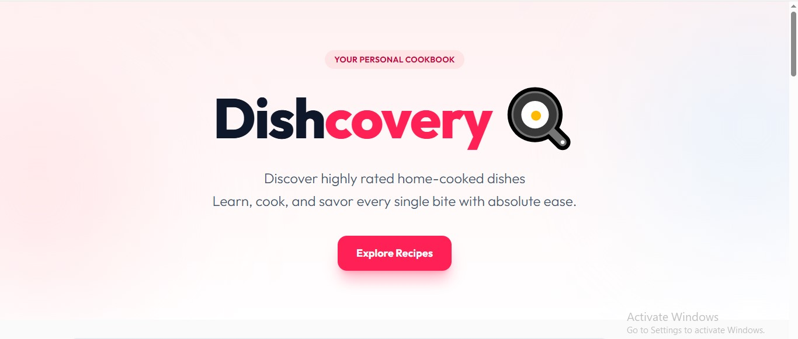

# 🍳 Dishcovery – Modern Recipe Finder

## Project Overview
Dishcovery is a lightning-fast recipe discovery application that helps home cooks and food enthusiasts find endless culinary inspiration. It combines beautifully designed interfaces with a robust data-fetching architecture, transforming the messy experience of browsing recipe sites into a sleek, application-like workflow where users can seamlessly search, scroll, and save their favorite meals.

## Screenshots



## Key Features & Challenges
Dishcovery offers an infinite-scrolling feed of random recipes, instantaneous debounced searching by meal name or ingredient, and local persistence of customized "Favorites" lists. 
**The Challenge:** Migrating the project from a static json data to an  asynchronous data from a third-party API without overwhelming the client or creating duplicate UI elements. 
**The Solution:** I abstracted all data fetching into custom hooks powered by TanStack Query, guaranteeing background caching and deduplication. I also built pure utility functions (`normalizeRecipe.js`) that ingest and sanitize the irregular API payloads before they ever touch the React UI layer.

---

## Technologies Used
- **Frontend Framework:** React 19
- **Build Tool:** Vite
- **Styling:** Tailwind CSS v4 
- **State Management (Server):** `@tanstack/react-query` v5
- **Utilities:** `lodash.debounce`
- **Data Source:** TheMealDB API (Free Tier)

---

## Architecture Overview
Dishcovery operates as a purely front-end Single Page Application (SPA). 
The architecture strongly separates concerns:
1. **The UI Layer (`components/`)**: React components are entirely stateless regarding external data; they rely only on props.
2. **The Hook Layer (`hooks/`)**: Custom hooks orchestrate queries and mutations. They act as the middleman between the UI and TanStack Query.
3. **The API Layer (`api/` & `utils/`)**: Raw fetch requests happen here. The responses are passed through normalizers to ensure the UI only receives strictly structured, predictable Javascript Objects.

---

## Technical Decisions
- **TanStack Query over `useEffect`**: I chose TanStack Query for server-state management instead of standard React state. This provides out-of-the-box caching, background refetching, and pagination management, preventing redundant API calls and drastically improving perceived load speeds.
- **Intersection Observer over Pagination Buttons**: I implemented the `IntersectionObserver` native API for infinite scrolling rather than "Load More" buttons. This creates a friction-free browsing experience standard in modern social-media-style feeds.
- **Debounced Inputs**: I utilized `lodash.debounce` on the search bar to delay API requests by 500ms after the user stops typing, significantly lowering the volume of network requests sent to TheMealDB.

---

## Setup & Installation
To run Dishcovery locally, follow these steps:

```bash
# 1. Clone the repository
git clone https://github.com/Starr365/Dishcovery.git

# 2. Navigate into the directory
cd dishcovery

# 3. Install dependencies
npm install

# 4. Start the development server
npm run dev
```
*The project uses the public, free tier of TheMealDB API. No `.env` configuration or API keys are required to run the development server.*

---

## Usage
- **Browse:** Simply scroll down the page! New recipes will load automatically via infinite scroll.
- **Search:** Type an ingredient (e.g., "Chicken") or a dish name into the search bar. The grid will automatically update.
- **Save:** Click the "Favorite" button (🤍) on any recipe card to save it. You can view all saved recipes by clicking "Show Favorites Only".
- **View Details:** Click any recipe card to open the Modal, which displays a large hero image, cleanly formatted ingredient tags, and step-by-step cooking instructions.

---

## API Integration
The application integrates with [TheMealDB public API](https://www.themealdb.com/api.php).
- **Random Meals:** `random.php` - Fetched in batches to support infinite scrolling.
- **Search:** `search.php?s={query}` - Triggered dynamically via the debounced search bar.
- **Lookup:** `lookup.php?i={id}` - Used to hydrate the full recipe details of user Favorites from `localStorage`.

---

## Folder Structure
```text
src/
├── api/             # API service endpoints (fetch/axios wrappers)
├── components/      # Reusable UI React components (Cards, Modals, Loaders)
├── hooks/           # Custom React hooks managing TanStack server state
├── utils/           # Pure Javascript helper functions (data deduplication, normalizers)
├── App.jsx          # Main application routing and core UI state (search/filters)
├── main.jsx         # React root and QueryClientProvider
└── index.css        # Tailwind directives and custom CSS variables
```

---

## Contributing
Contributions are welcome! 
1. Fork the project.
2. Create your feature branch (`git checkout -b feature/AmazingFeature`).
3. Commit your changes (`git commit -m 'Add some AmazingFeature'`).
4. Push to the branch (`git push origin feature/AmazingFeature`).
5. Open a Pull Request.
*Please ensure any new features align with the current Tailwind design system and maintain strict separation of concerns.*

---

## Testing
Currently, the application relies on manual testing. 
Key manual test workflows include:
- Verifying the `IntersectionObserver` correctly triggers `fetchNextPage` only at the bottom of the grid.
- Ensuring rapid toggling of the "Favorite" button immediately syncs with `localStorage` without causing UI desync.
- Searching for invalid recipes yields the customized "Empty State" component.

---

## Performance, Accessibility & Best Practices
- **Performance:** Expensive components are wrapped in `React.memo` to prevent cascading re-renders. Complex callback functions utilize `useCallback`. Loading states are handled via animated `SkeletonRecipeCard` grids to eliminate Cumulative Layout Shift (CLS).
- **Accessibility (A11y):** Form inputs lack visible labels for design purposes but include visually hidden `.sr-only` tags for screen readers. Interactive modal elements and buttons utilize semantic `aria-label` tags. High contrast text colors enforce WCAG readable contrast ratios.

---

## License & Support
Distributed under the MIT License. See `LICENSE` for more information.
For support or questions, please open an issue in the GitHub repository.

---

## Acknowledgements
- Massive thanks to [TheMealDB](https://www.themealdb.com/) for providing a fantastic, free, and open API for culinary data.
- Design inspired by modern, premium food-delivery and recipe applications.
